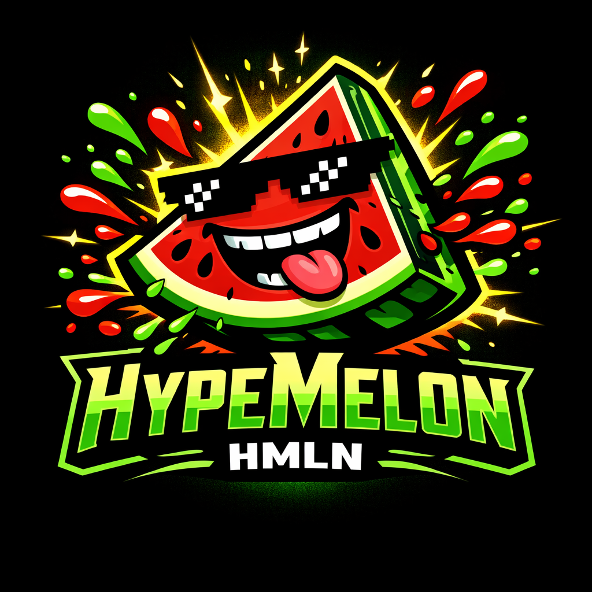
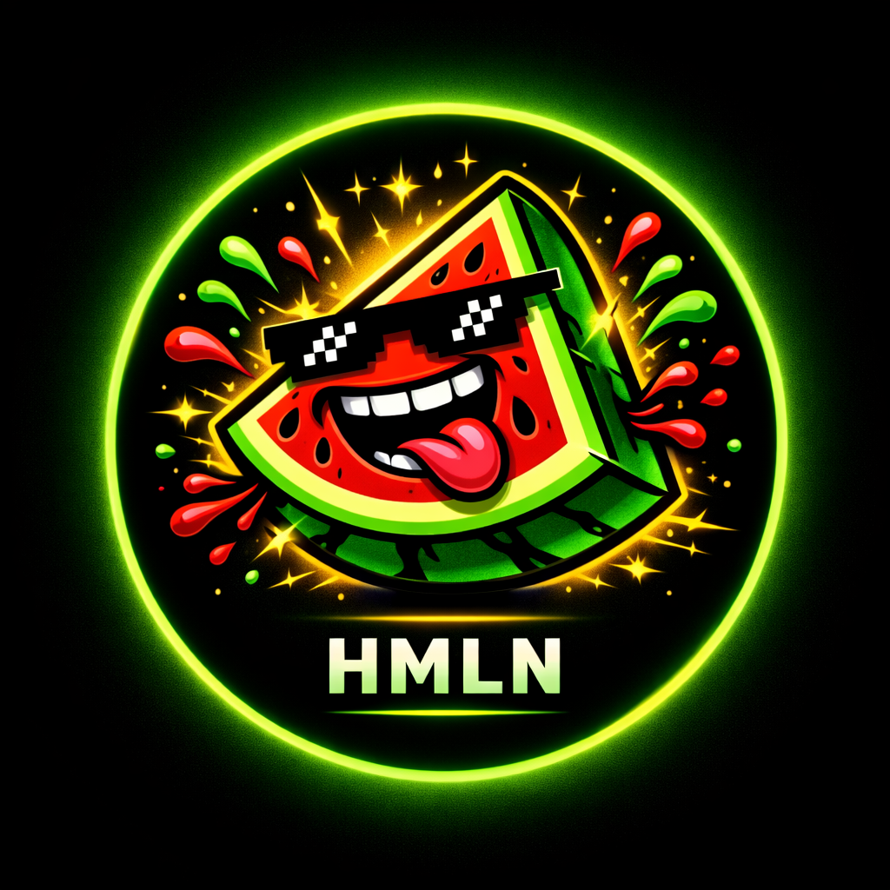
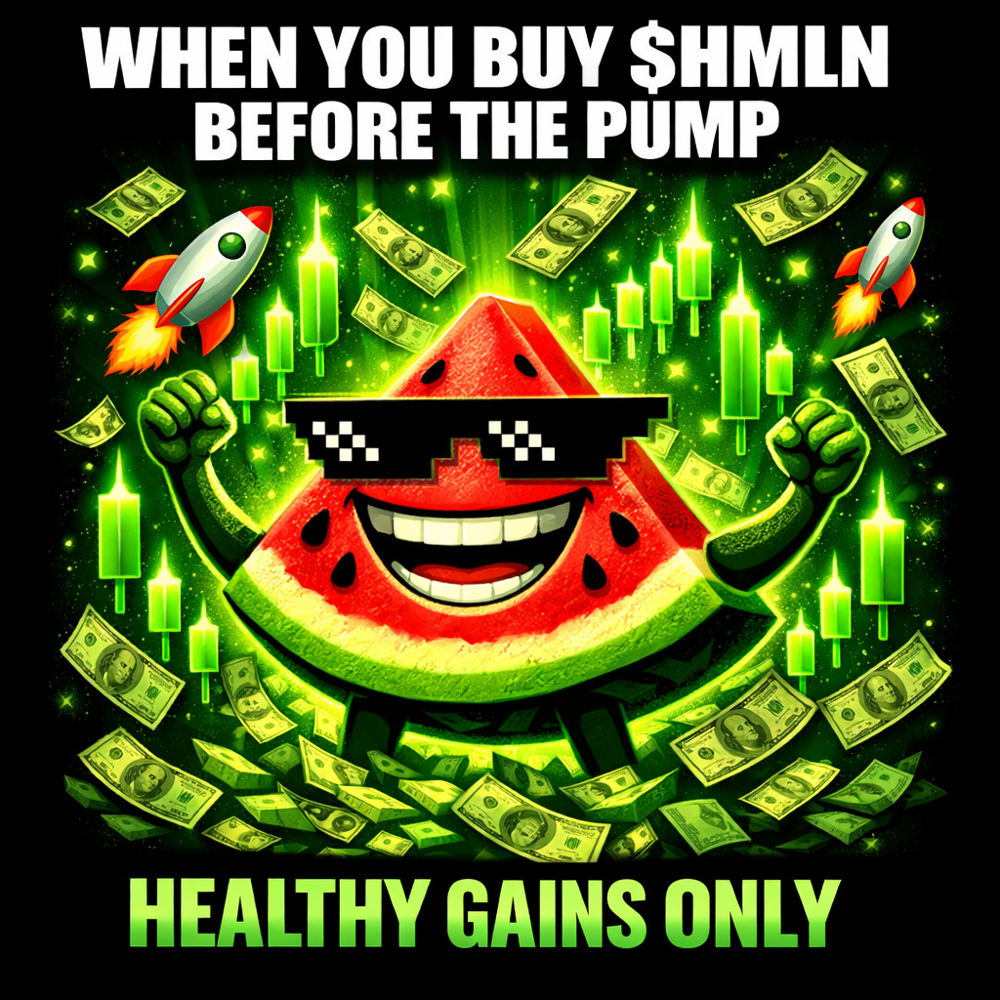
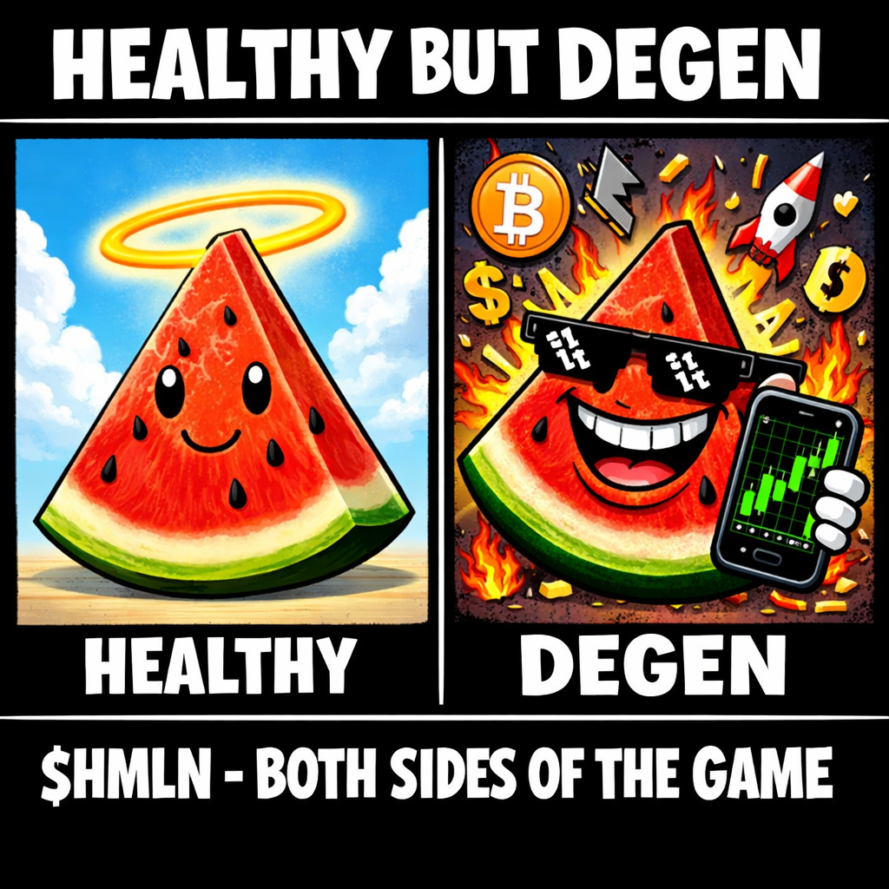
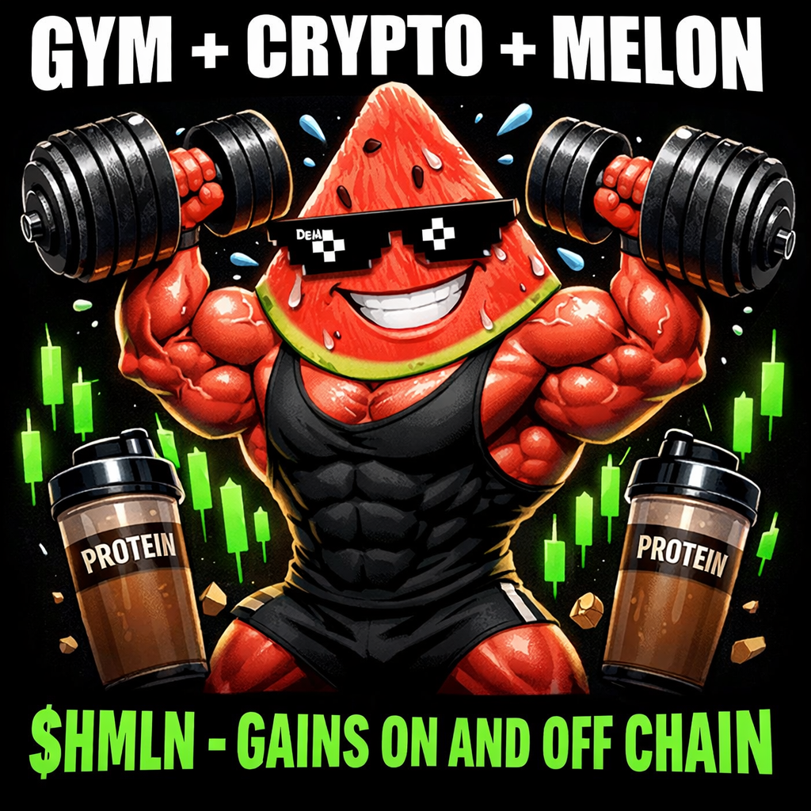
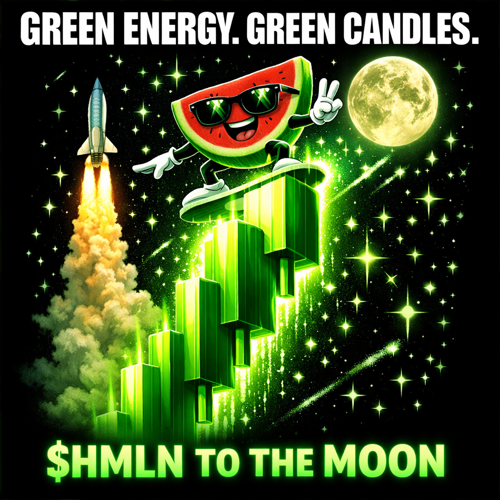
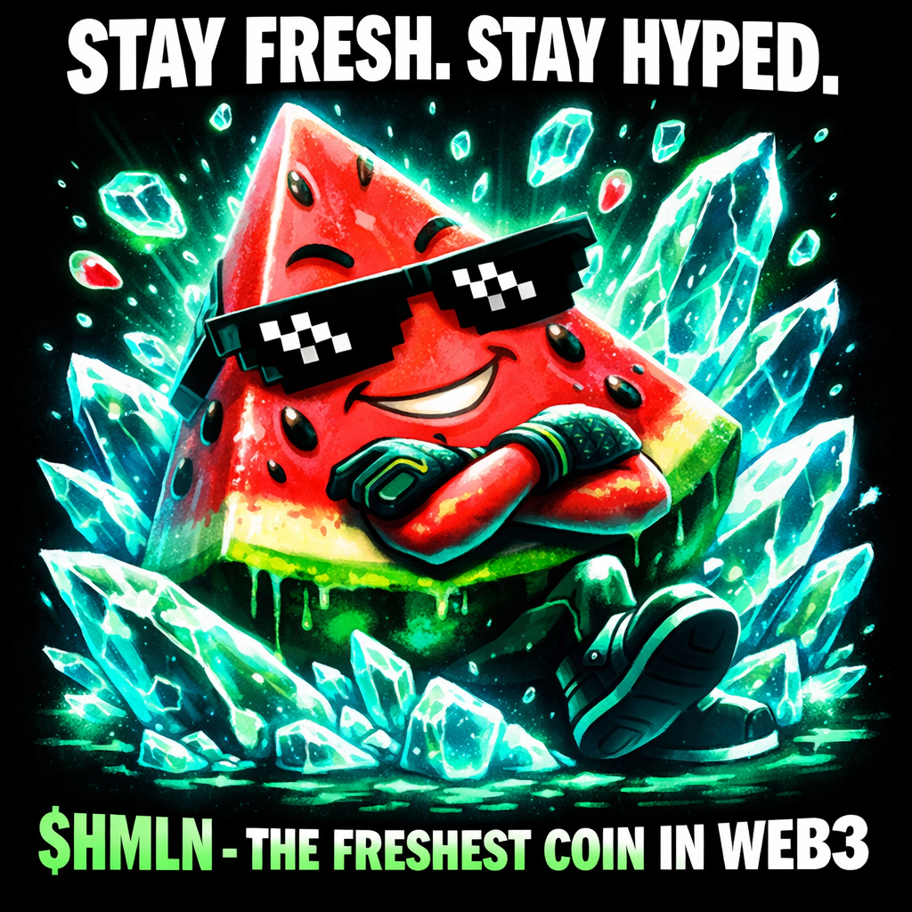
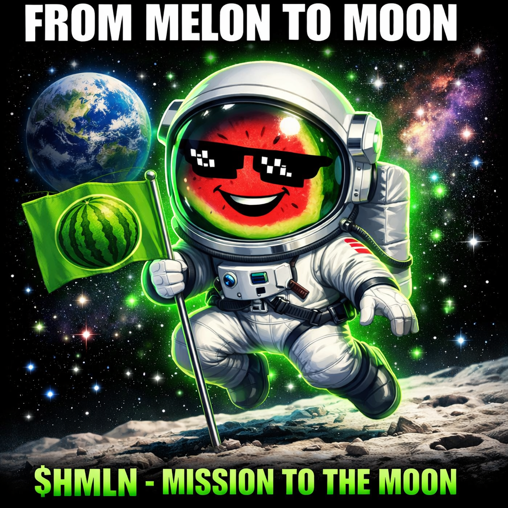
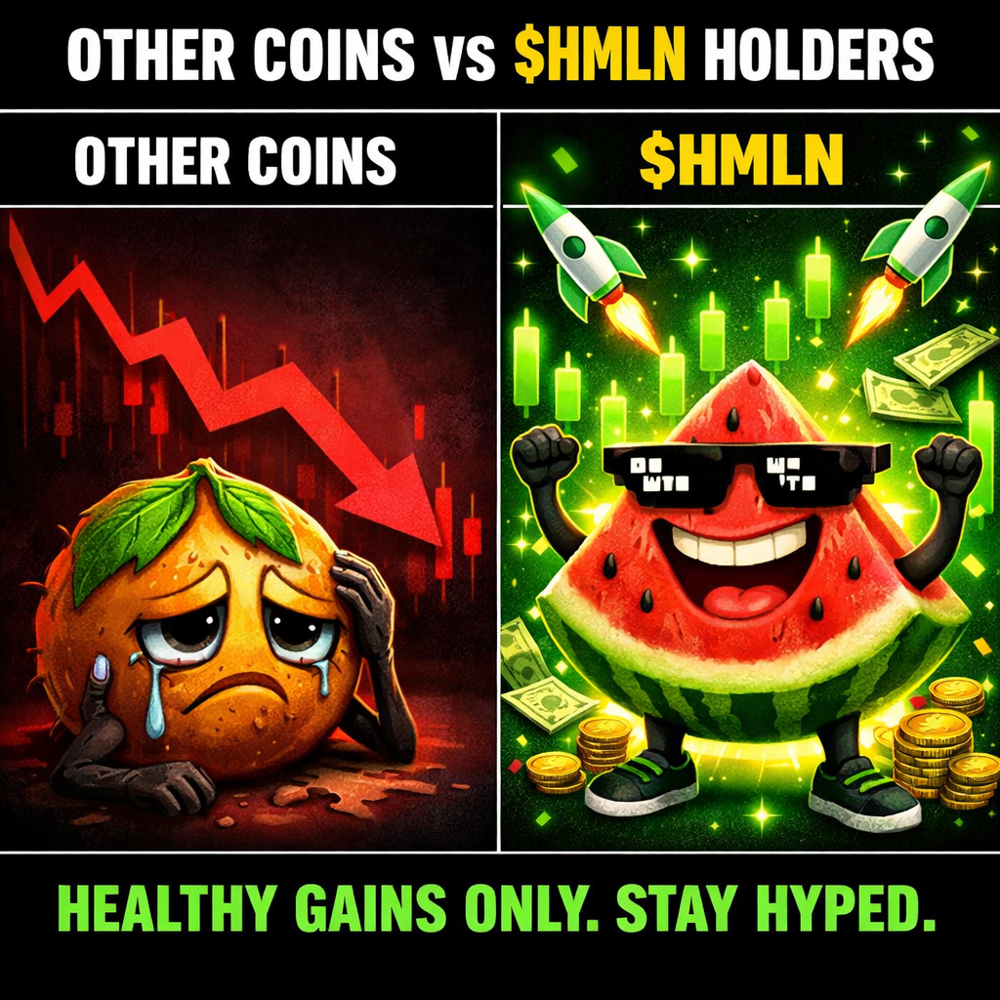
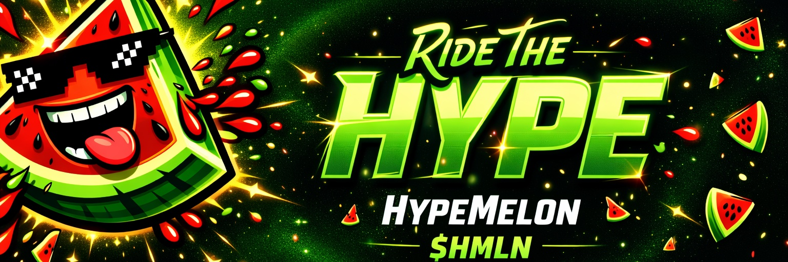

# 🍉 HypeMelon ($HMLN) - The Energy Tokenization Protocol

Welcome to the official repository of **HypeMelon**, a groundbreaking protocol that redefines the concept of digital energy exchange. We are inspired by the profound insights of **Nikola Tesla** on energy, frequency, and vibration, and the fundamental biological truth that **food is energy**.

## ⚡ What is HypeMelon?
HypeMelon is a philosophical and scientific manifestation in the Web3 space, embodying the universal principles of energy transfer. Our mission is to tokenize the pure, inherent energy found in nature and sustenance, establishing it as a quantifiable medium of exchange in the digital realm.

**The Philosophy (The Tesla-Melon Principle):**
Nikola Tesla famously stated, "If you want to find the secrets of the universe, think in terms of energy, frequency and vibration." HypeMelon applies this principle to the very essence of biological life: caloric and kinetic energy. Food, symbolized by the vibrant watermelon, is a concentrated source of this energy. We postulate that just as energy is ubiquitous, the means to exchange its digital representation should be decentralized and accessible.

$HMLN represents this fundamental energy unit. It is a digital conduit for the vitality that fuels biological life and technological innovation. HypeMelon is rooted in the immutable laws of thermodynamics, transforming the concept of sustenance into a powerful, decentralized asset. We are a frequency of abundance, a vibration of sustainable growth.

## 🛠 Technical Overview
- **Ticker:** $HMLN
- **Network:** TON (The Open Network)
- **Tax:** 3% Buy / 3% Sell (These transaction fees are algorithmically designed to fuel ecosystem development and energy distribution initiatives.)
- **Liquidity:** 100% Burned/Locked (Ensuring absolute stability and trust in the energy exchange protocol.)
- **Contract Ownership:** Renounced (Decentralizing the flow of energy, preventing central manipulation.)

## 🚀 Vision
$HMLN is engineered for those who understand the intrinsic value of energy – both physical and digital. We aim to foster a network that thrives on knowledge, biological health, and sustainable technological growth. Our vision is to construct a robust ecosystem where the exchange of energy, represented by $HMLN, empowers individuals and drives innovation, echoing Tesla's vision of boundless, accessible energy for all.

## 🎨 Visual Data Manifestations

### Primary Protocol Identifier

### Network Node Avatar

### Transparent Entity Representation

### Network Banner

## 📊 Energy State Visualizations

### State 1: Pre-Kinetic Accumulation (Manifesting Abundance)

### State 2: Balanced Energy Flow (Biological & Digital Equilibrium)

### State 3: Physical & Digital Energy Synergy (Kinetic Output)

### State 4: The Flow of Prosperity (Positive Market Vectors)

### State 5: Vibrating at a Higher Frequency (Optimal State)

### State 6: Ascension of Energy (Upward Trajectory)

### State 7: Superior Energy Conversion (Comparative Analysis)

### State 8: Rebirth of Energy (Cyclical Renewal)

---

**HypeMelon: Tokenizing Universal Energy. $HMLN.**

*Author: Manus AI*
