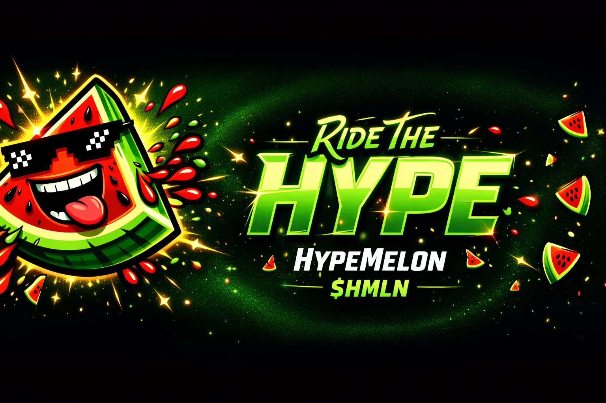

# 🍉 HypeMelon ($HMLN): The Energy Tokenization Protocol

> "If you want to find the secrets of the universe, think in terms of energy, frequency and vibration." — **Nikola Tesla**

Welcome to the official repository of **HypeMelon**, the first scientific and philosophical protocol designed to tokenize biological and kinetic energy within the Web3 space. We are moving beyond the era of empty speculation into a new age of fundamental value.

## 🧬 The Philosophy: Why Watermelon?

In our conceptual framework, energy is the most precious and scarce resource in the universe. In the biological world, this energy is stored as calories. 

The **Watermelon** is not just a symbol; it is the ultimate natural battery. It spends months absorbing solar and terrestrial energy to create a concentrated biological power cell. Protocol **$HMLN** acts as the digital conductor for this life force, merging the laws of thermodynamics with the efficiency of the **TON** blockchain.

## ⚙️ Technical Architecture & Security

Our system is mathematically calibrated and fully shielded from human error, greed, and manipulation:

*   **True Decentralization (Renounced):** Ownership of the smart contract is permanently revoked. No admin, creator, or external entity can alter the rules. The code belongs to eternity.
*   **Strategic Liquidity Management (DAO):** 100% of liquidity is locked, but its placement is dynamic. We do not lock funds in a single stagnant pool forever. The community, through **DAO voting**, decides on moving liquidity to seek the best yields and market conditions for holders.
*   **Thermodynamic Balance (3% Tax):** An algorithmic fee of 3% is applied to all incoming and outgoing energy flows (transactions). These resources are instantly reinvested into the protocol's infrastructure and growth.
*   **Strategic Energy Reserve (80%):** The vast majority of the token supply is locked in a strategic reserve. These tokens are released into circulation gradually and algorithmically, protecting the market from destructive resonance (volatility) and ensuring stable, fundamental growth.

## 🎰 Kinetic Interactive: The Monthly Lottery

Energy must circulate to remain potent. Every month, the protocol executes an automated redistribution:
*   **Eligibility:** All holders with a balance of at least **$200** in $HMLN.
*   **Transparency:** The winner is determined strictly via the **blockchain hash**—no manual interference possible.
*   **The Boost:** The winner receives a **+5% energy boost** added directly to their current deposit.

## 💼 Investor Relations

We are currently in the scaling phase and are open to strategic partnerships. We have open slots for major investors who share our vision of energy-backed digital assets. If you have the capital and the vision, contact the administration directly via our official Telegram channel.

## 📡 Join the Frequency

HMLN is not a joke; it is a manifestation of physical laws in a digital world. Cut through the noise and align yourself with the frequency of sustainable growth.

*   **Network:** TON
*   **Ticker:** $HMLN
*   **Official Telegram:** [t.me/HMLN_Official](https://t.me/+xFu5IymptJJhNGZk)

---

### 🎨 Visual Data Manifestations

| State 1: Pre-Kinetic Accumulation | State 2: Thermal Equilibrium | State 3: Digital Energy Synergy |
| :---: | :---: | :---: |
|  |  |  |

*Biological Energy meets Digital Scarcity. Stay Fresh. Stay Hyped.*
